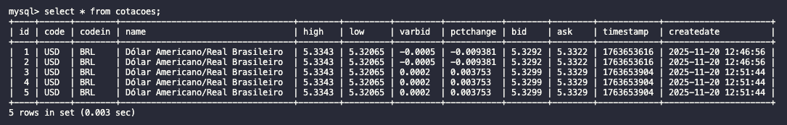

# 📝 Como Executar os Projetos

## 🚀 1. Executando o Servidor

### ▶️ Acesse o diretório do servidor

``` bash
cd server
```

### ▶️ Inicialize o Docker (MySQL)

``` bash
docker-compose up -d
```

### ▶️ Conecte ao MySQL

``` bash
mysql -h 127.0.0.1 -P 3306 -u root -p
```

**Senha:** `123456`

### ▶️ Para realizar consulta




### ▶️ Inicie o servidor Go

``` bash
go run main.go
```

### ▶️ Verifique se está funcionando

Abra no navegador ou use `curl`:

    http://localhost:8080/ping

------------------------------------------------------------------------

## ⚠️ Importante

O tempo limite de **10ms para salvar no banco** não é suficiente.\
Testes com **SQL puro** e também com **GORM** mostraram que **nenhuma
das opções consegue persistir os dados dentro desse tempo**.

------------------------------------------------------------------------

## 💻 2. Executando o Cliente

### ▶️ Acesse o diretório do cliente

``` bash
cd client
```

### ▶️ Execute o cliente Go

``` bash
go run main.go
```

Após a execução, será gerado o arquivo:

    cotacao.txt
